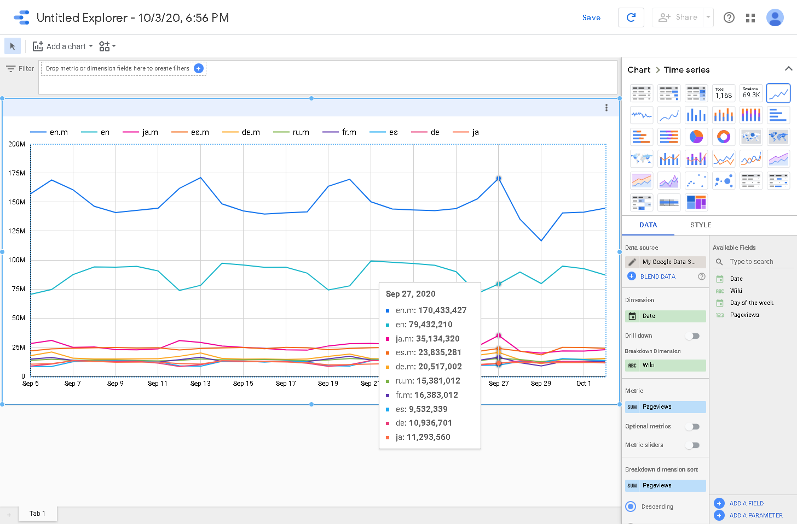

Google Data Studio Comunity Conncetor for BigQuery
==================================================

A Google Data Studio [Community Connector](https://developers.google.com/datastudio/connector)
providing data from Big Query. The definition of the dimensions and metrics are defined by a
JSON-based schema file, making it easy to customize.

&nbsp;

Screenshots
-----------
The dimension/metric view of a sample data set based on the public available pageviews
of wikipedia. See also Big Query tables `bigquery-public-data.wikipedia.pageviews_*`.


&nbsp;

The Data Studio Explorer view showing the last 28 days of pageview performance per wiki:



&nbsp;


Build requirements
------------------
1. a Google account
2. a Google Cloud Project where you have permissions to create Google Cloud Storage buckets
3. a local linux-based computer with
    - `make` - to be able to run Makefile
    - [Google Cloud SDK](https://cloud.google.com/sdk/docs/quickstart) - for sync of files to
      Google Cloud Storage
    - [clasp](https://github.com/google/clasp) - for creation and managing of Google Apps Script

&nbsp;

Build instructions
------------------

After installing the requirements, call

``` bash
clasp login
gcloud auth login
cp config.mk.example config.mk
```

Now, review file `config.mk` and make your adjustments. When finished, call
``` bash
make
```
to start the deployment.

You are now ready to go :tada:<br/>
You should now have a new [Google Apps Script](https://script.google.com/) in your
Google account with the name you previously defined in `config.mk`. Open the
script via clicking once on it and then clicking on _Open Project_. Click now on _Publish → Deploy from manifest_.
In the new opened popup you will see the deployments of your script.

When you click on the link below _Latest Version (Head)_, Google Data Studio will
open with the request to connect to the newly build connector.
